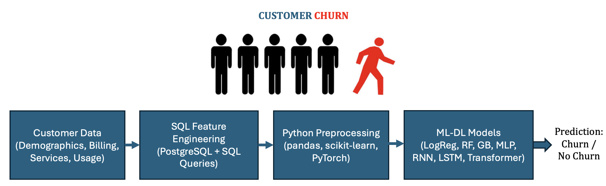

# Telco Churn Prediction

This project tackles the **customer churn prediction problem** using the **Telco Customer Churn dataset** (synthetically extended for sequential usage behavior).  

We address churn prediction in **two complementary ways**:  

1. **Flat / Tabular Churn Prediction**  
   - Predict churn from static customer and contract attributes.  
   - Models: Logistic Regression, Random Forest, Gradient Boosting, Feedforward Neural Network (MLP).  

2. **Sequential Churn Prediction**  
   - Predict churn from **time-series behavior** such as monthly charges, data usage, and complaints.  
   - Models: RNN, LSTM, and Transformer-based sequence models.  

Beyond machine learning, this project emphasizes **end-to-end data handling**:  

- **PostgreSQL database** for storing Telco customer data.  
- **Schema design** for customer, billing, services, churn, and sequential usage tables.  
- **SQL queries** for feature engineering, aggregation, and data exploration.  
- **Python integration** (`psycopg2` + `pandas`) for loading and preparing data for ML models.  

By combining database design, SQL feature engineering, and ML modeling, this project demonstrates a full-stack approach to solving a **realistic churn prediction problem**.




---

## Project Structure

```
telco-churn-prediction/
│── data/
│   ├── billing.csv
│   ├── churn.csv
│   ├── contracts.csv
│   ├── customers.csv
│   ├── services.csv
│   ├── telco_sequential.csv         # sequential dataset
│
│── sql/
│   ├── schema_only.sql
│   ├── feature_engineering.sql
│   ├── feature_engineering_sequential.sql   # SQL script for sequential features
│
│── scripts/
│   └── load_csv_to_postgres.py
│
│── notebooks/
│   ├── data_exploration.ipynb               # EDA on flat churn dataset
│   ├── churn_prediction.ipynb               # modeling on flat dataset
│   ├── data_exploration_sequential.ipynb    # EDA on sequential dataset
│   ├── churn_prediction_sequential.ipynb    # modeling on sequential dataset
│
│── src/
│   ├── db_utils.py
│   ├── data_prep.py
│   ├── models.py
│   ├── train.py
│   ├── evaluate.py
│   └── sequential/                         # sequence-specific utilities
│       ├── data_prep_seq.py
│       ├── models_seq.py   # e.g. RNN, LSTM, Transformer
│       ├── train_seq.py
│       ├── evaluate_seq.py
│
│── requirements.txt
│── README.md
```

---

## Setup Instructions

This project requires **Python 3.10+** and **PostgreSQL** installed locally.

### 1. Clone the repository
```bash
git clone https://github.com/yourusername/telco-churn-prediction.git
cd telco-churn-prediction
```

### 2. Create and activate a conda environment
```bash
conda create -n telco_churn python=3.10 -y
conda activate telco_churn
```

### 3. Install Python dependencies
```bash
pip install -r requirements.txt
```

> **Note:** We use `psycopg2-binary` instead of `psycopg2` because it comes precompiled and avoids the need for PostgreSQL development headers.  
> This makes installation easier and more reproducible across different systems.  
> In production environments, the recommended package is `psycopg2` (source build).

### 4. Install PostgreSQL
Make sure PostgreSQL is installed and the `psql` client is available in your PATH.

* On macOS (Homebrew):
```bash
brew install postgresql
```

* On Ubuntu/Debian:
```bash
sudo apt-get install postgresql postgresql-contrib
```

### 5. Create and initialize the database
```bash
createdb -U your_user telco_db
psql -U your_user -d telco_db -f sql/schema_only.sql
```

### 6. Load data
```bash
python scripts/load_csv_to_postgres.py
```

### 7. Update database credentials
In `src/db_utils.py`, replace `user` and `password` with your PostgreSQL credentials:

```python
conn = psycopg2.connect(
    dbname="telco_db",
    user="your_user",
    password="your_password",
    host="localhost",
    port="5432"
)
```

### 8. Run the notebooks
* `notebooks/data_exploration.ipynb` →  Explore and visualize original flat/tabular churn dataset  
* `notebooks/churn_prediction.ipynb` → Logistic Regression, Random Forest, Gradient Boosting, and FFNN/MLP models  
* `notebooks/data_exploration_sequential.ipynb` → Explore and visualize sequential churn dataset  
* `notebooks/churn_prediction_sequential.ipynb` → Sequential modeling with RNN, LSTM, and Transformer  

---

## Key Highlights
- SQL-based **feature engineering** (static + sequential features).  
- Integration of **PostgreSQL** with Python (`psycopg2`).  
- Comparison of classical ML models (Logistic Regression, Random Forest, Gradient Boosting) and a neural network model (MLP).
- Sequential deep learning models (RNN, LSTM, Transformer).  
- Evaluation with **classification metrics**, **confusion matrices**, and **ROC-AUC curves**.  

